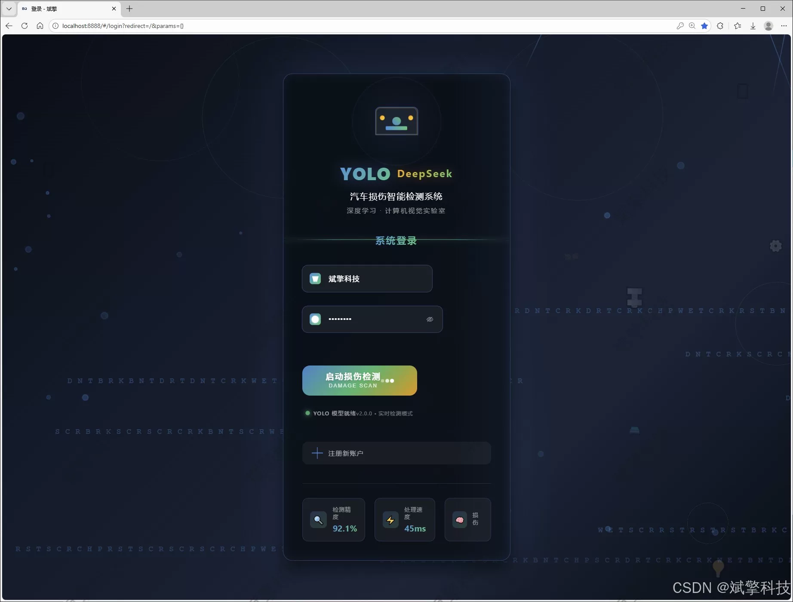
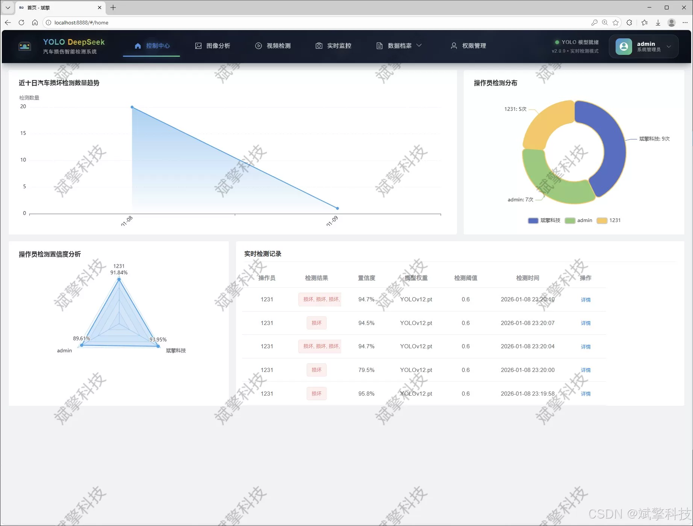
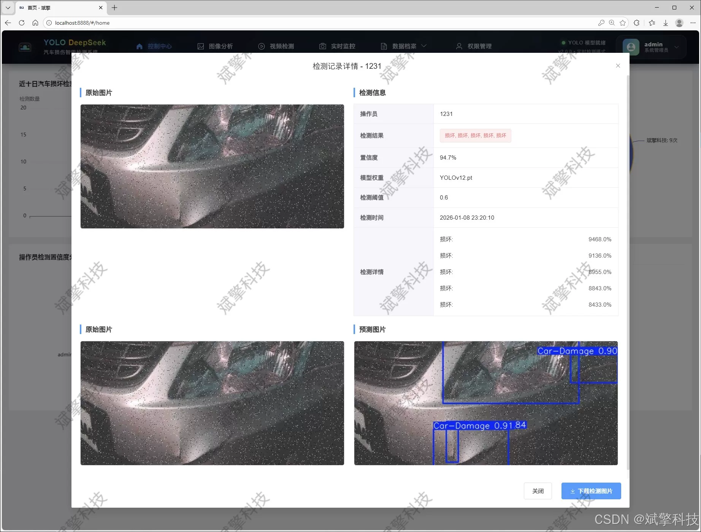
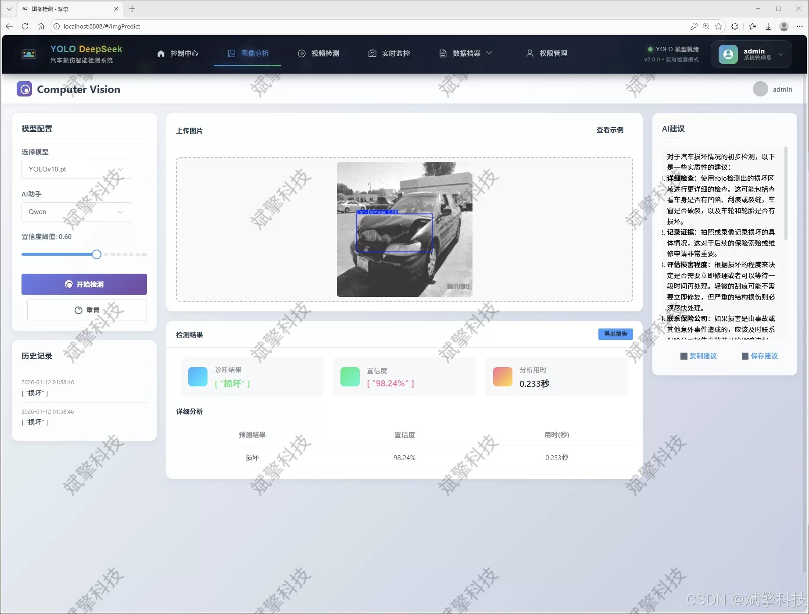
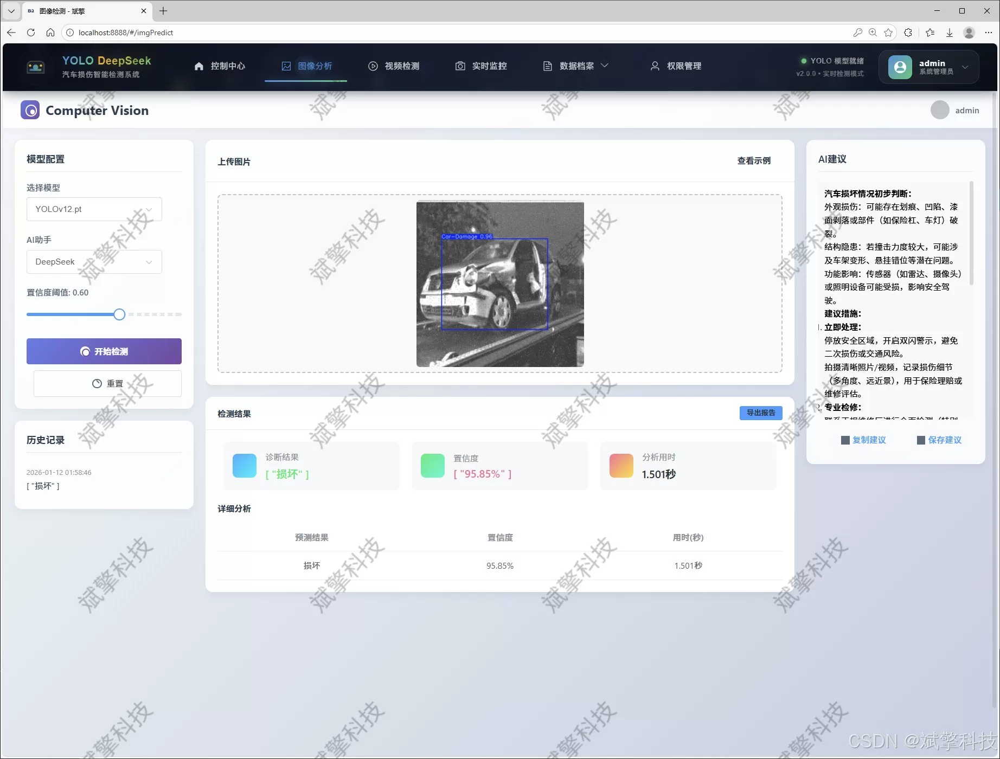
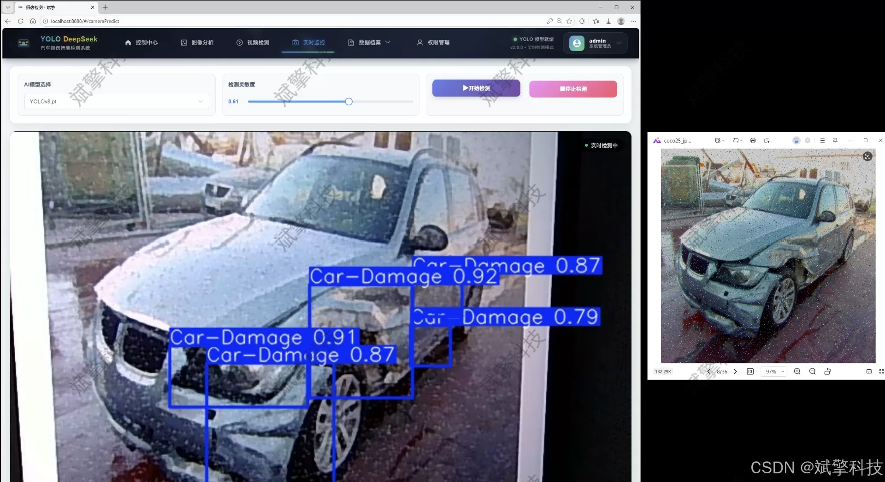
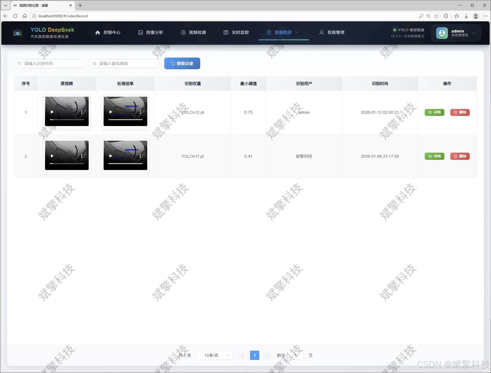
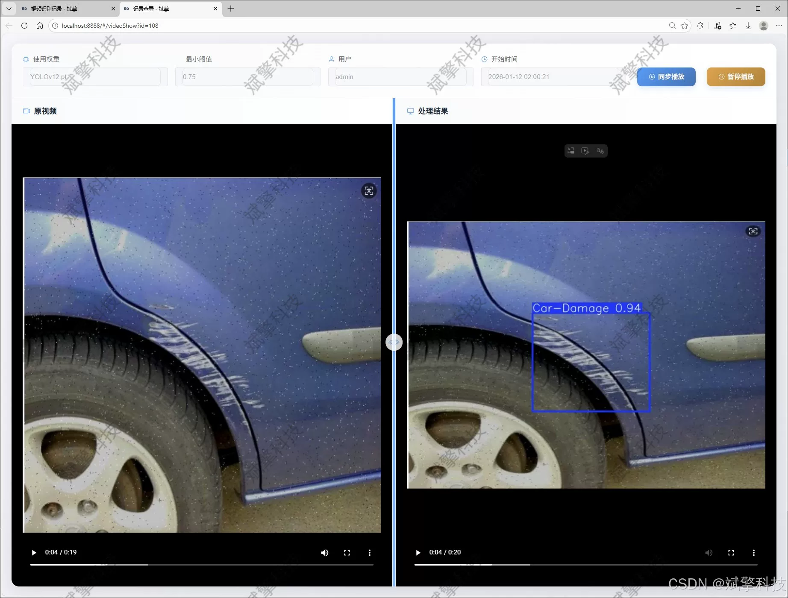
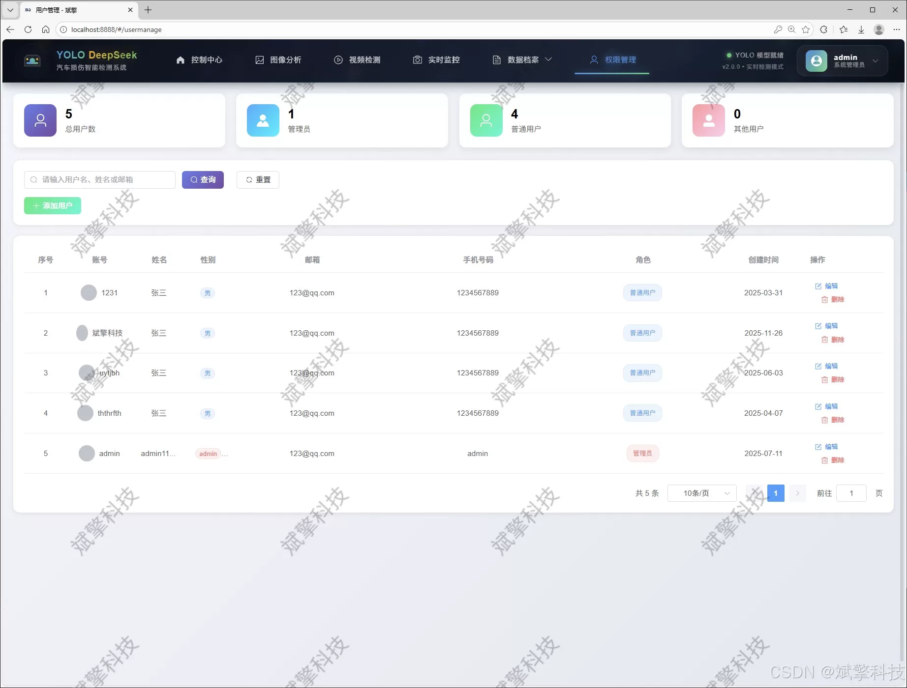

# Based on YOLO deep learning and the large models of Qianwen and DeepSeek for automotive damage detection

## Body

Based on YOLO deep learning and the large models of Qianwen, DeepSeek intelligent analysis system for automotive damage detection (DeepSeek intelligent analysis + web interface interaction + front-end separation + YOLO data + YOLOv8/YOLOv10/YOLOv11/YOLOv12)

With the continuous growth in car ownership and the rapid development of intelligent transportation systems, vehicle damage detection technology has become a key technical demand in insurance claims, used car evaluation, and intelligent traffic management. This study designed and implemented an intelligent automotive damage detection system based on YOLO series deep learning models and SpringBoot framework. The system integrates four advanced object detection algorithms: YOLOv8, YOLOv10, YOLOv11, and YOLOv12, building a high-precision, high-efficiency automotive damage detection platform.

The system adopts a front-end separation architecture, with the backend built on the SpringBoot framework and the front end using modern Web technologies combined with MySQL database for data storage and management. The system innovatively introduces the DeepSeek intelligent analysis module to provide users with more in-depth explanations of detection results and repair suggestions. By collecting and labeling a specialized dataset containing 10,218 training images, 971 validation images, and 486 test images (including a single category "Car-Damage"), the system achieves accurate recognition and localization of various types of vehicle damages such as scratches, dents, and cracks.

Experimental results show that the system maintains high detection accuracy across multiple YOLO model switches, achieving an mAP of 92.1% on the test set, demonstrating optimal performance. The system supports three modes of image, video, and real-time camera detection, along with comprehensive user management, recognition record management, and data visualization features, offering good practicality and scalability. This research provides a complete solution for autonomous vehicle damage detection, with broad application prospects in insurance appraisal, vehicle maintenance, and intelligent transportation.

Functional modules
✅ User login registration: Support password verification and save to MySQL database.
✅ Support switching among four YOLO models: YOLOv8, YOLOv10, YOLOv11, YOLOv12.
✅ Information visualization, data visualization.
✅ Image detection support AI analysis functions, deepseek and Qianwen.
✅ Support image detection, video detection, and real-time camera detection, detection results saved to MySQL database.
✅ Image recognition record management, video recognition record management, and camera recognition record management.
✅ User management module, administrator can add, delete, update, and view users.
✅ Personal center, can modify personal information, password name profile picture etc.

## Images

## Payment

Here is a pay link on Stripe ( https://buy.stripe.com/3cs8yP7sY87d0vu9AB ). Please contact me lonlonago@foxmail.com after funding $89, and I will send you a complete data files , thank you!

